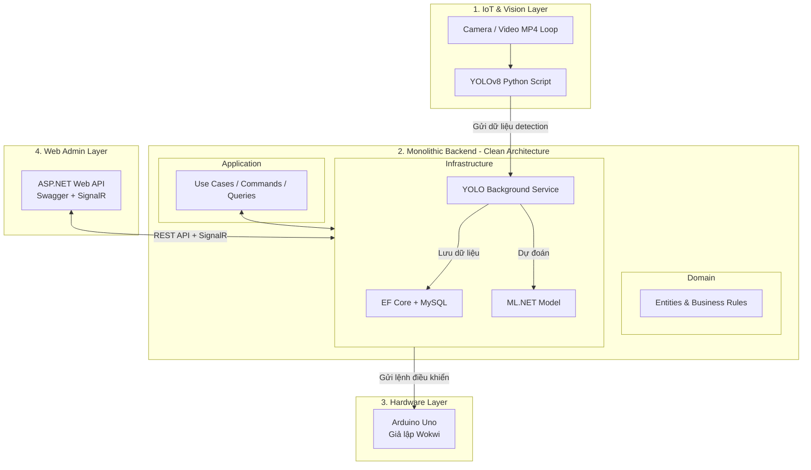

# 🚦 HỆ THỐNG ĐÈN GIAO THÔNG THÔNG MINH THÍCH ỨNG THEO LƯU LƯỢNG XE

**Sử dụng Computer Vision (YOLOv8), Machine Learning (ML.NET) và Clean Architecture (.NET 9)**

---

## 📋 Mục Lục

- [1. Ý Tưởng Dự Án](#1-ý-tưởng-dự-án)
- [2. Kiến Trúc Hệ Thống](#2-kiến-trúc-hệ-thống)
- [3. Công Nghệ Sử Dụng](#3-công-nghệ-sử-dụng)
- [4. Cấu Trúc Source Code](#4-cấu-trúc-source-code)
- [5. Hướng Dẫn Cài Đặt & Chạy](#5-hướng-dẫn-cài-đặt--chạy)
- [6. API Endpoints](#6-api-endpoints)

---

## 1. Ý Tưởng Dự Án

Hệ thống đèn giao thông thông minh được thiết kế nhằm khắc phục hạn chế của hệ thống đèn cố định truyền thống.

### Ý tưởng cốt lõi

Đèn giao thông sẽ **tự động điều chỉnh thời gian đèn xanh/đỏ** dựa trên **mật độ lưu lượng xe thực tế** tại giao lộ:

1. **Camera** thu thập hình ảnh/video lưu lượng xe tại giao lộ.
2. **YOLOv8** (Python) phân tích video và đếm số lượng xe.
3. **ML.NET** dự đoán thời gian đèn tối ưu dựa trên dữ liệu lưu lượng.
4. **Backend (.NET 9)** xử lý logic nghiệp vụ và gửi lệnh điều khiển đến Arduino.
5. **Arduino Uno** (giả lập Wokwi) nhận lệnh và điều khiển đèn LED.
6. **Web Admin** giám sát thời gian thực, xem biểu đồ và manual override.

### Mục tiêu chính

- ✅ Tăng hiệu quả lưu thông, giảm ùn tắc.
- ✅ Đáp ứng yêu cầu môn học: Arduino Uno (giả lập), Database, Web hiển thị.
- ✅ Áp dụng Clean Architecture để đảm bảo tính mở rộng và bảo trì.


## 2. Kiến Trúc Hệ Thống



### Luồng xử lý chính

```
Camera → YOLOv8 (đếm xe) → Backend (xử lý + ML.NET dự đoán) → Arduino (điều khiển đèn)
                                    ↕
                              MySQL (lưu trữ)
                                    ↕
                            Web Admin (giám sát)
```

---

## 3. Công Nghệ Sử Dụng

| Thành phần       | Công nghệ                        | Mục đích                              |
| ----------------- | --------------------------------- | ------------------------------------- |
| **Backend**       | .NET 9 / ASP.NET Core Web API    | Xử lý logic nghiệp vụ, REST API      |
| **ORM**           | Entity Framework Core             | Truy vấn & quản lý database           |
| **Database**      | MySQL                             | Lưu trữ dữ liệu lịch sử giao thông  |
| **ML**            | ML.NET                            | Dự đoán thời gian đèn tối ưu         |
| **Computer Vision** | YOLOv8 (Python)                | Phát hiện và đếm xe từ camera         |
| **Hardware**      | Arduino Uno (Wokwi giả lập)      | Điều khiển đèn LED giao thông        |
| **API Docs**      | Swagger / Swashbuckle             | Tài liệu hóa API tự động             |
| **Realtime**      | SignalR                           | Giao tiếp realtime Web ↔ Backend      |

---

## 4. Cấu Trúc Source Code

```
SmartTrafficLightSystem.sln                    # Solution file chính (.NET 9)
│
├── ProjectDocument.MD                         # Tài liệu mô tả dự án
├── README.MD                                  # File hướng dẫn này
│
└── src/
    │
    ├── SmartTrafficLight-Domain/               # 🟢 DOMAIN LAYER - Lõi nghiệp vụ (không phụ thuộc layer nào)
    │   ├── SmartTrafficLight-Domain.csproj     # Project file - không có dependency ngoài
    │   ├── Entities/                           # Các entity chính (TrafficData, Intersection, TrafficLight,...)
    │   ├── Enums/                              # Enum định nghĩa trạng thái (LightState, Direction,...)
    │   ├── Interfaces/                         # Interface repository (ITrafficDataRepository,...)
    │   └── ValueObjects/                       # Value Object (TimingConfig, DetectionResult,...)
    │
    ├── SmartTrafficLight-Application/          # 🔵 APPLICATION LAYER - Xử lý use case & logic ứng dụng
    │   ├── SmartTrafficLight-Application.csproj # Project file - phụ thuộc Domain
    │   ├── Common/                             # Shared utilities, base classes, exceptions
    │   ├── Features/                           # Các tính năng chính của hệ thống
    │   │   ├── Admin/                          # Use case quản trị: xem log, cấu hình hệ thống
    │   │   ├── LightControl/                   # Use case điều khiển đèn: chuyển đèn, manual override
    │   │   ├── MLPrediction/                   # Use case dự đoán ML: gọi model, trả kết quả timing
    │   │   └── TrafficDetection/               # Use case phát hiện xe: xử lý data từ YOLO, lưu DB
    │   ├── Interfaces/                         # Interface cho các service (IMLPredictionService,...)
    │   └── Services/                           # Application services (orchestration logic)
    │
    ├── SmartTrafficLight-Infrastructure/       # 🟠 INFRASTRUCTURE LAYER - Triển khai kỹ thuật cụ thể
    │   ├── SmartTrafficLight-Infrastructure.csproj # Project file - phụ thuộc Application + Domain
    │   ├── Background/                         # Background Service: chạy YOLO, xử lý detection liên tục
    │   ├── Data/                               # DbContext, Migrations, Seed Data cho MySQL
    │   ├── ML/                                 # Tích hợp ML.NET: load model, predict timing
    │   ├── Messaging/                          # Hệ thống messaging (mở rộng trong tương lai)
    │   └── Persistence/                        # Repository implementations (EF Core → MySQL)
    │
    └── SmartTrafficLight-Web/                  # 🔴 WEB / PRESENTATION LAYER - API & Giao diện
        ├── SmartTrafficLight-Web.csproj        # Project file - phụ thuộc Application + Infrastructure
        ├── Program.cs                          # Entry point: cấu hình DI, middleware, Swagger
        ├── RoutePrefixConvention.cs            # Convention tự động thêm prefix "api/v1" cho tất cả route
        ├── appsettings.json                    # Cấu hình chung (connection string, logging,...)
        ├── appsettings.Development.json        # Cấu hình riêng cho môi trường Development
        ├── Controllers/                        # API Controllers xử lý HTTP request
        │   └── HelloControllers.cs             # Controller mẫu - test API hoạt động
        ├── Components/                         # Blazor/Razor Components cho UI (nếu dùng)
        ├── Hubs/                               # SignalR Hubs: push data realtime đến Web Admin
        ├── Pages/                              # Razor Pages cho giao diện Web Admin
        └── Properties/
            └── launchSettings.json             # Cấu hình port & profile khi chạy dev
```

### Dependency giữa các layer (Clean Architecture)

```
Domain  ←──  Application  ←──  Infrastructure
                                      ↑
                                     Web
```

| Layer              | Phụ thuộc vào            | Vai trò                                            |
| ------------------ | ------------------------ | -------------------------------------------------- |
| **Domain**         | *Không có*               | Định nghĩa entity, enum, interface - lõi nghiệp vụ |
| **Application**    | Domain                   | Chứa use case, orchestration, business logic        |
| **Infrastructure** | Application, Domain      | Triển khai cụ thể: DB, ML, Background Service       |
| **Web**            | Application, Infrastructure | Entry point, API controller, UI, DI config        |

---

## 5. Hướng Dẫn Cài Đặt & Chạy

### Yêu cầu hệ thống

- [.NET 9 SDK](https://dotnet.microsoft.com/download/dotnet/9.0)
- [MySQL Server](https://dev.mysql.com/downloads/) (hoặc Docker)
- [Python 3.10+](https://www.python.org/) (cho YOLOv8)
- [Git](https://git-scm.com/)

### Cài đặt

```bash
# 1. Clone repository
git clone <repository-url>
cd Iot_Final_Project

# 2. Restore NuGet packages
dotnet restore

# 3. Cấu hình connection string MySQL trong appsettings.json
# (Cập nhật file src/SmartTrafficLight-Web/appsettings.json)

# 4. Chạy ứng dụng
cd src/SmartTrafficLight-Web
dotnet run
```

### Truy cập

| URL                              | Mô tả                  |
| -------------------------------- | ----------------------- |
| `http://localhost:5212`          | Web Application         |
| `http://localhost:5212/swagger`  | Swagger API Docs        |
| `http://localhost:5212/api/v1/*` | REST API  

---

## 6. API Endpoints

### Hiện tại

| Method | Endpoint             | Mô tả              |
| ------ | -------------------- | ------------------- |
| GET    | `/api/v1/MeoMeo`     | Test API (Hello World) |

> **Dự án IoT** – Hệ thống đèn giao thông thông minh thích ứng theo lưu lượng xe  
> Clean Architecture • .NET 9 • YOLOv8 • ML.NET • MySQL • SignalR
