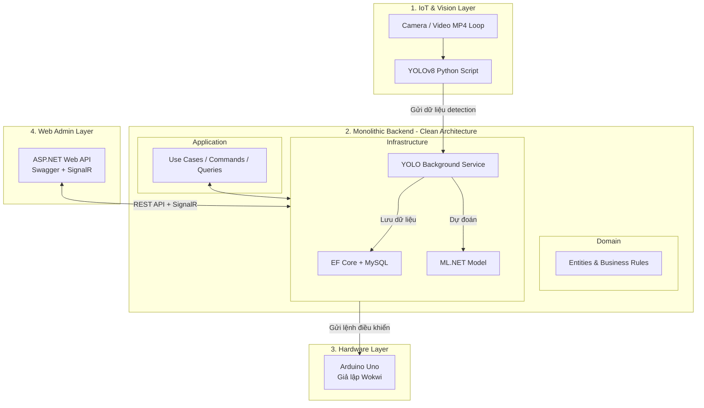

# 🚦 HỆ THỐNG ĐÈN GIAO THÔNG THÔNG MINH THÍCH ỨNG THEO LƯU LƯỢNG XE

**Sử dụng Computer Vision (YOLOv8), Machine Learning (ML.NET) và Clean Architecture (.NET 9)**

---

## 📋 Mục Lục

- [1. Ý Tưởng Dự Án](#1-ý-tưởng-dự-án)
- [2. Kiến Trúc Hệ Thống](#2-kiến-trúc-hệ-thống)
- [3. Công Nghệ Sử Dụng](#3-công-nghệ-sử-dụng)
- [4. Cấu Trúc Source Code](#4-cấu-trúc-source-code)
- [5. Hướng Dẫn Cài Đặt & Chạy](#5-hướng-dẫn-cài-đặt--chạy)
- [6. API Endpoints](#6-api-endpoints)

---

## 1. Ý Tưởng Dự Án

Hệ thống đèn giao thông thông minh được thiết kế nhằm khắc phục hạn chế của hệ thống đèn cố định truyền thống.

### Ý tưởng cốt lõi

Đèn giao thông sẽ **tự động điều chỉnh thời gian đèn xanh/đỏ** dựa trên **mật độ lưu lượng xe thực tế** tại giao lộ:

1. **Camera** thu thập hình ảnh/video lưu lượng xe tại giao lộ.
2. **YOLOv8** (Python) phân tích video và đếm số lượng xe.
3. **ML.NET** dự đoán thời gian đèn tối ưu dựa trên dữ liệu lưu lượng.
4. **Backend (.NET 9)** xử lý logic nghiệp vụ và gửi lệnh điều khiển đến Arduino.
5. **Arduino Uno** (giả lập Wokwi) nhận lệnh và điều khiển đèn LED.
6. **Web Admin** giám sát thời gian thực, xem biểu đồ và manual override.

### Mục tiêu chính

- ✅ Tăng hiệu quả lưu thông, giảm ùn tắc.
- ✅ Đáp ứng yêu cầu môn học: Arduino Uno (giả lập), Database, Web hiển thị.
- ✅ Áp dụng Clean Architecture để đảm bảo tính mở rộng và bảo trì.


## 2. Kiến Trúc Hệ Thống


```mermaid
graph TD
    subgraph "1. IoT & Vision Layer"
        Camera[Camera / Video MP4 Loop]
        YOLO[YOLOv8 Python Script]
    end

    subgraph "2. Monolithic Backend - Clean Architecture"
        subgraph "Domain"
            Entities[Entities & Business Rules]
        end
        subgraph "Application"
            UseCases[Use Cases / Commands / Queries]
        end
        subgraph "Infrastructure"
            EF[EF Core + MySQL]
            ML[ML.NET Model]
            Background[YOLO Background Service]
        end
    end

    subgraph "3. Hardware Layer"
        Arduino[Arduino Uno<br/>Giả lập Wokwi]
    end

    subgraph "4. Web Admin Layer"
        WebUI[ASP.NET Web API<br/>Swagger + SignalR]
    end

    Camera --> YOLO
    YOLO -->|Gửi dữ liệu detection| Background
    Background -->|Lưu dữ liệu| EF
    Background -->|Dự đoán| ML
    UseCases <--> Infrastructure
    Infrastructure -->|Gửi lệnh điều khiển| Arduino
    WebUI <-->|REST API + SignalR| Infrastructure
```

### Luồng xử lý chính

```
Camera → YOLOv8 (đếm xe) → Backend (xử lý + ML.NET dự đoán) → Arduino (điều khiển đèn)
                                    ↕
                              MySQL (lưu trữ)
                                    ↕
                            Web Admin (giám sát)
```

---

## 3. Công Nghệ Sử Dụng

| Thành phần       | Công nghệ                        | Mục đích                              |
| ----------------- | --------------------------------- | ------------------------------------- |
| **Backend**       | .NET 9 / ASP.NET Core Web API    | Xử lý logic nghiệp vụ, REST API      |
| **ORM**           | Entity Framework Core             | Truy vấn & quản lý database           |
| **Database**      | MySQL                             | Lưu trữ dữ liệu lịch sử giao thông  |
| **ML**            | ML.NET                            | Dự đoán thời gian đèn tối ưu         |
| **Computer Vision** | YOLOv8 (Python)                | Phát hiện và đếm xe từ camera         |
| **Hardware**      | Arduino Uno (Wokwi giả lập)      | Điều khiển đèn LED giao thông        |
| **API Docs**      | Swagger / Swashbuckle             | Tài liệu hóa API tự động             |
| **Realtime**      | SignalR                           | Giao tiếp realtime Web ↔ Backend      |

---

## 4. Cấu Trúc Source Code

```
SmartTrafficLightSystem.sln                    # Solution file chính (.NET 9)
│
├── ProjectDocument.MD                         # Tài liệu mô tả dự án
├── README.MD                                  # File hướng dẫn này
│
└── src/
    │
    ├── SmartTrafficLight-Domain/               # 🟢 DOMAIN LAYER - Lõi nghiệp vụ (không phụ thuộc layer nào)
    │   ├── SmartTrafficLight-Domain.csproj     # Project file - không có dependency ngoài
    │   ├── Entities/                           # Các entity chính (TrafficData, Intersection, TrafficLight,...)
    │   ├── Enums/                              # Enum định nghĩa trạng thái (LightState, Direction,...)
    │   ├── Interfaces/                         # Interface repository (ITrafficDataRepository,...)
    │   └── ValueObjects/                       # Value Object (TimingConfig, DetectionResult,...)
    │
    ├── SmartTrafficLight-Application/          # 🔵 APPLICATION LAYER - Xử lý use case & logic ứng dụng
    │   ├── SmartTrafficLight-Application.csproj # Project file - phụ thuộc Domain
    │   ├── Common/                             # Shared utilities, base classes, exceptions
    │   ├── Features/                           # Các tính năng chính của hệ thống
    │   │   ├── Admin/                          # Use case quản trị: xem log, cấu hình hệ thống
    │   │   ├── LightControl/                   # Use case điều khiển đèn: chuyển đèn, manual override
    │   │   ├── MLPrediction/                   # Use case dự đoán ML: gọi model, trả kết quả timing
    │   │   └── TrafficDetection/               # Use case phát hiện xe: xử lý data từ YOLO, lưu DB
    │   ├── Interfaces/                         # Interface cho các service (IMLPredictionService,...)
    │   └── Services/                           # Application services (orchestration logic)
    │
    ├── SmartTrafficLight-Infrastructure/       # 🟠 INFRASTRUCTURE LAYER - Triển khai kỹ thuật cụ thể
    │   ├── SmartTrafficLight-Infrastructure.csproj # Project file - phụ thuộc Application + Domain
    │   ├── Background/                         # Background Service: chạy YOLO, xử lý detection liên tục
    │   ├── Data/                               # DbContext, Migrations, Seed Data cho MySQL
    │   ├── ML/                                 # Tích hợp ML.NET: load model, predict timing
    │   ├── Messaging/                          # Hệ thống messaging (mở rộng trong tương lai)
    │   └── Persistence/                        # Repository implementations (EF Core → MySQL)
    │
    └── SmartTrafficLight-Web/                  # 🔴 WEB / PRESENTATION LAYER - API & Giao diện
        ├── SmartTrafficLight-Web.csproj        # Project file - phụ thuộc Application + Infrastructure
        ├── Program.cs                          # Entry point: cấu hình DI, middleware, Swagger
        ├── RoutePrefixConvention.cs            # Convention tự động thêm prefix "api/v1" cho tất cả route
        ├── appsettings.json                    # Cấu hình chung (connection string, logging,...)
        ├── appsettings.Development.json        # Cấu hình riêng cho môi trường Development
        ├── Controllers/                        # API Controllers xử lý HTTP request
        │   └── HelloControllers.cs             # Controller mẫu - test API hoạt động
        ├── Components/                         # Blazor/Razor Components cho UI (nếu dùng)
        ├── Hubs/                               # SignalR Hubs: push data realtime đến Web Admin
        ├── Pages/                              # Razor Pages cho giao diện Web Admin
        └── Properties/
            └── launchSettings.json             # Cấu hình port & profile khi chạy dev
```

### Dependency giữa các layer (Clean Architecture)

```
Domain  ←──  Application  ←──  Infrastructure
                                      ↑
                                     Web
```

| Layer              | Phụ thuộc vào            | Vai trò                                            |
| ------------------ | ------------------------ | -------------------------------------------------- |
| **Domain**         | *Không có*               | Định nghĩa entity, enum, interface - lõi nghiệp vụ |
| **Application**    | Domain                   | Chứa use case, orchestration, business logic        |
| **Infrastructure** | Application, Domain      | Triển khai cụ thể: DB, ML, Background Service       |
| **Web**            | Application, Infrastructure | Entry point, API controller, UI, DI config        |

---

## 5. Hướng Dẫn Cài Đặt & Chạy

### Yêu cầu hệ thống

- [.NET 9 SDK](https://dotnet.microsoft.com/download/dotnet/9.0)
- [MySQL Server](https://dev.mysql.com/downloads/) (hoặc Docker)
- [Python 3.10+](https://www.python.org/) (cho YOLOv8)
- [Git](https://git-scm.com/)

### Cài đặt

```bash
# 1. Clone repository
git clone <repository-url>
cd Iot_Final_Project

# 2. Restore NuGet packages
dotnet restore

# 3. Cấu hình connection string MySQL trong appsettings.json
# (Cập nhật file src/SmartTrafficLight-Web/appsettings.json)

# 4. Chạy ứng dụng
cd src/SmartTrafficLight-Web
dotnet run
```

### Truy cập

| URL                              | Mô tả                  |
| -------------------------------- | ----------------------- |
| `http://localhost:5212`          | Web Application         |
| `http://localhost:5212/swagger`  | Swagger API Docs        |
| `http://localhost:5212/api/v1/*` | REST API  

---

## 6. API Endpoints

### 6.1 Health & System Endpoints

| Method | Endpoint             | Mô tả              | Response |
| ------ | -------------------- | ------------------- | --------- |
| GET    | `/api/health/db`     | Kiểm tra kết nối Database | `{ status: "Healthy", database: "Connected", timestamp }` |
| GET    | `/api/v1/MeoMeo`     | Health check endpoint | Hello World response |

### 6.2 Traffic Data Management Endpoints

| Method | Endpoint             | Mô tả              | Tham số |
| ------ | -------------------- | ------------------- | --------- |
| POST   | `/api/v1/traffic`    | Ghi nhận dữ liệu phát hiện xe từ YOLO | `{ intersectionId, direction, vehicleCount }` |
| GET    | `/api/v1/traffic/current` | Lấy số lượng xe hiện tại theo hướng | `?intersectionId=...&direction=NORTH` |
| GET    | `/api/v1/traffic/history` | Lấy dữ liệu giao thông lịch sử | `?intersectionId=...&minutes=30` |

### 6.3 Traffic Light Control Endpoints

| Method | Endpoint             | Mô tả              | Tham số/Body |
| ------ | -------------------- | ------------------- | --------- |
| POST   | `/api/v1/lights/override` | Override thủ công trạng thái đèn (Admin) | `{ intersectionId, direction, forcedState }` |
| GET    | `/api/v1/admin/dashboard/{intersectionId}` | Lấy dữ liệu tập hợp dashboard | `intersectionId: guid` |

### 6.4 AI Prediction Endpoints

| Method | Endpoint             | Mô tả              | Tham số |
| ------ | -------------------- | ------------------- | --------- |
| GET    | `/api/v1/prediction/timing` | Dự đoán thời gian tối ưu từ ML | `?currentVehicleCount=45&timeOfDay=...` |

### 6.5 Hardware Control Endpoints (Arduino Communication)

| Method | Endpoint             | Mô tả              | Tham số/Body |
| ------ | -------------------- | ------------------- | --------- |
| POST   | `/api/v1/hardware/vehicle-counts` | Xử lý số lượng xe từ YOLO → Tính toán Webster | `{ nsVehicles, ewVehicles, source? }` |
| GET    | `/api/v1/hardware/detection-history` | Lấy 20 bản ghi phân tích phát hiện gần nhất | `?count=20` |
| GET    | `/api/v1/hardware/webster-result` | Lấy kết quả tính toán Webster mới nhất | - |
| GET    | `/api/v1/hardware/status` | Lấy trạng thái hiện tại từ Arduino | - |
| POST   | `/api/v1/hardware/force-state` | Bắt buộc Arduino chuyển sang trạng thái cụ thể ngay lập tức (0-3) | `{ stateIndex: 0-3 }` |
| POST   | `/api/v1/hardware/reset` | Reset Arduino về trạng thái ban đầu (NS_GREEN) | - |
| POST   | `/api/v1/hardware/timing` | Cập nhật thời lượng xanh của các pha | `{ nsGreenDuration, ewGreenDuration }` |
| POST   | `/api/v1/hardware/mode` | Bật/tắt chế độ Vô Tận (Infinite Mode - AI Actuated) | `{ isInfinite: boolean }` |
| POST   | `/api/v1/hardware/jump` | Chuyển đổi an toàn đến pha xanh cụ thể (0=NS, 2=EW) | `{ stateIndex: 0\|2 }` |

---

## 7. SignalR Hub Events (Real-time)

**Hub URL**: `/hubs/traffic` (WebSocket connection)

### Events được phát tới Frontend:

| Event | Payload | Mô tả |
|-------|---------|-------|
| `ReceiveHardwareStatus` | `{ statusMessage: "[B-N:XANH D-T:DO] Con lai: 35s" }` | Cập nhật trạng thái Arduino mỗi 1 giây |
| `ReceiveWebsterUpdate` | `{ cycleTime, greenNS, greenEW, totalFlowRatio, status, pcuNS, pcuEW }` | Cập nhật kết quả Webster sau mỗi lần xử lý |
| `ReceiveLightStateAsync` | `{ intersectionId, direction, currentLightState }` | Phát khi trạng thái đèn thay đổi |
| `ReceiveTrafficUpdateAsync` | `{ direction, vehicleCount }` | Phát khi số lượng xe cập nhật |

---

## 8. Frontend Pages & Features

### 8.1 Main Dashboard (`http://localhost:3000/`)

Trang này cung cấp giám sát thời gian thực toàn bộ hệ thống giao thông:

**Section 1: Header Navigation**
- Logo và tiêu đề hệ thống
- Nút điều hướng "AI FORECAST" → `/forecast`
- Nút bật/tắt "INFINITE MODE" (AI Actuated)
- Nút "RESET" để khôi phục trạng thái ban đầu
- Chỉ báo trạng thái kết nối SignalR (CONNECTED/RECONNECTING/DISCONNECTED) với ping animation

**Section 2: Intersection Status Panel**
- Hiển thị 4 hướng giao lộ (Bắc/Nam/Đông/Tây)
- Trực quan hóa đèn giao thông thực tế với hiệu ứng chiếu sáng
- Bộ đếm ngược thời gian (hoặc ∞ ở chế độ vô tận)
- Các nút ưu tiên Admin (chỉ khả dụng ở chế độ vô tận)

**Section 3: Camera Feeds Panel**
- 4 khung video camera mô phỏng (Bắc, Nam, Đông, Tây)
- Chỉ báo REC live (phục vụ demo)
- Nhãn định vị camera

**Section 4: Realtime Traffic Flow Table**
- Nhật ký các thay đổi trạng thái có dấu thời gian
- Trạng thái đèn NS/EW (ĐỎ/VÀNG/XANH)
- Thời gian đếm ngược cho mỗi bản ghi (20 bản ghi gần nhất)

**Section 5: AI Timing Analysis (Webster Method)**
- Thời kỳ chu kỳ tối ưu (40-120 giây)
- Phân bổ thời gian xanh (NS:EW split) với thanh tiến độ
- Mật độ lưu lượng (PCU/giờ) cho mỗi hướng
- Chỉ số tỷ lệ dòng chảy (Flow Ratio Y) với cảnh báo quá tải
- Chỉ báo trạng thái (NORMAL/OVERLOADED)

**Section 6: System Activity Logs**
- Nhật ký sự kiện theo thời gian thực (tối đa 30 bản ghi)
- Mã màu: xanh (thành công), đỏ (lỗi), vàng (cảnh báo), xám (thông tin)
- Bản ghi ghi lại tất cả các hành động: kết nối, mở lại kết nối, gửi lệnh, lỗi

### 8.2 AI Forecast Page (`http://localhost:3000/forecast`)

Dự báo giao thông dựa trên Machine Learning:

**Tính năng:**
- Dự báo giao thông 24 giờ
- Phân tích xe theo loại (ô tô, xe máy, xe buýt, xe tải)
- Biểu đồ dự báo sử dụng Recharts
- Phân loại trạng thái dựa trên ML (NORMAL/HEAVY/OVERLOADED)
- Dự đoán chu kỳ tối ưu theo giờ
- Tab chuyển đổi: Xem dự báo ↔ Xem phân tích xe

### 8.3 Detection History Page (`http://localhost:3000/history`)

Xem lịch sử các bản ghi phát hiện chi tiết:

**Tính năng:**
- Hiển thị 50 bản ghi phát hiện gần nhất từ database
- Số lượng xe theo hướng (NS/EW) theo loại
- Kết quả tính toán Webster cho mỗi bản ghi
- Chỉ báo trạng thái (NORMAL/OVERLOADED)
- Xu hướng mật độ lưu lượng
- Định dạng timestamp (DD/MM/YYYY HH:MM:SS)
- Khả năng làm mới dữ liệu live

---

## 9. Backend Services & Business Logic

### 9.1 Traffic Detection Service
**Chức năng:**
- `SaveDetectionDataAsync()` - Lưu dữ liệu phát hiện YOLO
- `GetCurrentTrafficAsync()` - Lấy số lượng xe mới nhất cho hướng
- `GetTrafficHistoryAsync()` - Lấy dữ liệu lịch sử theo phạm vi phút

### 9.2 Light Control Service
**Chức năng:**
- `SetLightStateAsync()` - Thay đổi trạng thái đèn với xác thực chuyển tiếp
- `ManualOverrideAsync()` - Override thủ công Admin với quy tắc an toàn (GREEN→YELLOW→RED)
- `GetDashboardDataAsync()` - Lấy dữ liệu dashboard tổng hợp

### 9.3 Webster Timing Service
**Chức năng:**
- `Calculate()` - Thực hiện thuật toán Webster tiêu chuẩn công nghiệp
- `GetLastResult()` - Truy xuất kết quả đã lưu trong bộ nhớ cache

**Thông số kỹ thuật:**
- Chuyển đổi PCU: Ô tô (1.0), Xe máy (0.35), Xe tải/Buýt (1.75)
- Làm mịn trung bình động (cửa sổ 10 mẫu)
- Phạm vi chu kỳ: 40-120 giây
- Phát hiện quá tải (Y ≥ 1.0)
- Dòng chảy bão hòa có thể cấu hình: 1850 PCU/h/làn
- Tổn thất khởi động: 3 giây mỗi pha
- Thời lượng vàng: 4 giây
- Khoảng trống all-red: 2 giây

### 9.4 ML Prediction Service
**Chức năng:**
- `PredictTimingAsync()` - Dự đoán thời gian cơ sở luật

**Quy tắc dự đoán:**
- \> 30 xe: 60s xanh, 3s vàng, 30s đỏ
- \> 20 xe: 40s xanh, 3s vàng, 30s đỏ
- ≤ 20 xe: 20s xanh, 3s vàng, 40s đỏ

### 9.5 Traffic Notification Service (SignalR)
**Chức năng:**
- `SendLightStateAsync()` - Phát thay đổi trạng thái đèn
- `SendTrafficUpdateAsync()` - Phát cập nhật lưu lượng
- `SendHardwareStatusAsync()` - Phát thay đổi trạng thái hardware
- `SendWebsterUpdateAsync()` - Phát kết quả Webster

### 9.6 Arduino Serial Service
**Chức năng:**
- `SendTimingUpdate()` - Lệnh: `T:ns,ew` (ví dụ: T:35,50)
- `SendReset()` - Lệnh: `R` (reset về NS_GREEN)
- `ForceState()` - Lệnh: `F:0-3` (bắt buộc trạng thái)
- `SetInfiniteMode()` - Lệnh: `M:0/1` (Auto hoặc Infinite)
- `RequestJump()` - Lệnh: `J:0/2` (chuyển đổi an toàn)
- `GetLatestStatus()` - Lấy trạng thái hiện tại
- Property: `IsInfiniteMode` (bool)

**Đặc tính:**
- Polling serial port mỗi 1 giây
- Tự động phát hiện cổng COM (COM2 mặc định)
- Tốc độ baud: 9600
- Tự động kết nối lại với logging

---

## 10. Hardware - Arduino Uno

### 10.1 Pinout Configuration (4 hướng × 3 màu)

| Hướng | ĐỎ | VÀNG | XANH |
|-------|----|----|------|
| **Bắc** | 2 | 3 | 4 |
| **Đông** | 5 | 6 | 7 |
| **Nam** | 8 | 9 | 10 |
| **Tây** | 11 | 12 | 13 |

### 10.2 Traffic States

| Index | Trạng thái | Mô tả |
|-------|-----------|-------|
| 0 | NS_GREEN_EW_RED | B-N: XANH, Đ-T: ĐỎ |
| 1 | NS_YELLOW_EW_RED | B-N: VÀNG, Đ-T: ĐỎ |
| 2 | NS_RED_EW_GREEN | B-N: ĐỎ, Đ-T: XANH |
| 3 | NS_RED_EW_YELLOW | B-N: ĐỎ, Đ-T: VÀNG |

### 10.3 Serial Commands

| Lệnh | Format | Chức năng | Ví dụ |
|------|--------|----------|-------|
| Status | `S` | In trạng thái hiện tại | `S\r\n` |
| Reset | `R` | Reset về NS_GREEN_EW_RED | `R\r\n` |
| Timing | `T:ns,ew` | Cập nhật thời lượng xanh | `T:35,50\r\n` |
| Force | `F:n` | Bắt buộc trạng thái (n=0-3) | `F:0\r\n` |
| Mode | `M:n` | Auto(0) hoặc Infinite(1) | `M:1\r\n` |
| Jump | `J:n` | Chuyển đổi an toàn (n=0 hoặc 2) | `J:0\r\n` |

### 10.4 Output Example

```
[B-N:XANH D-T:DO] Con lai: 35s
[B-N:DO D-T:XANH] Con lai: INFINITE
```

### 10.5 Operating Modes

- **AUTO**: Tự động chuyển đổi dựa trên thời lượng được cấu hình
- **INFINITE**: Ở lại trạng thái cho đến khi nhận lệnh jump (AI Actuated)

---

## 11. Computer Vision - YOLOv8 (Python)

### 11.1 Core Detection Module (`camera_detect/src/core.py`)

**Chức năng chính:**
- `detect_vehicles()` - Suy luận YOLO (conf: 0.25, IOU: 0.6, imgsz: 1920)
- `count_by_axis()` - Chia số lượng tại đường chia x=640
- `count_by_axis_detailed()` - Đếm theo loại xe trên mỗi trục
- `count_total_detailed()` - Tổng số đếm theo loại

**Lớp xe được hỗ trợ:**
| Lớp | Mã YOLO | Mô tả |
|-----|---------|-------|
| Car | 2 | Ô tô |
| Motorbike | 3 | Xe máy/Xe gắn máy |
| Bus | 5 | Xe buýt |
| Truck | 7 | Xe tải |

### 11.2 Video Detection (`detect_by_video.py`)

**Tính năng:**
- Nhập video kép (trái/phải hoặc NS/EW)
- Tự động lặp video
- Trực quan hóa thời gian thực với hộp giới hạn
- POST HTTP đến backend: `/api/v1/hardware/vehicle-counts`
- Kiểm soát hotkey: 1=cả hai đông, 2=đông/yên tĩnh, 3=cả hai yên tĩnh, q=thoát
- Khoảng báo cáo: 2 giây

### 11.3 Image Detection (`detect_by_image.py`)

**Tính năng:**
- Chế độ ảnh đơn (4 camera độc lập)
- Phân tích chi tiết trên mỗi hướng
- Bảng kết quả được định dạng đẹp

---

## 12. ML Prediction API (FastAPI - Python)

### 12.1 API Endpoints (`camera_detect/ml/api.py`)

| Method | Endpoint | Mô tả | Tham số |
|--------|----------|-------|--------|
| GET | `/` | Health check | - |
| GET | `/predict` | Dự báo 24 giờ | `?date=YYYY-MM-DD` |

**Response Example:**
```json
{
  "hour": "08:00",
  "total_vehicles": 150,
  "status": 1,
  "cycle_time": 85
}
```

**Trạng thái:**
- 0 = NORMAL (Bình thường)
- 1 = HEAVY (Nặng)
- 2 = OVERLOADED (Quá tải)

### 12.2 ML Models

| Mô hình | Loại | Mục đích |
|---------|------|---------|
| RandomForestClassifier | Classification | Dự đoán trạng thái giao thông |
| RandomForestRegressor | Regression | Dự đoán thời gian chu kỳ tối ưu |

**Tính năng đầu vào:**
- Giờ trong ngày
- Thứ trong tuần
- Cờ cuối tuần
- Cờ giờ cao điểm (7-9h, 17-19h)
- Tổng số xe

### 12.3 Training Module (`train_model.py`)

**Chức năng:**
- Lấy dữ liệu lịch sử từ MySQL
- Huấn luyện trên: giờ, dayofweek, is_weekend, is_rush_hour, total_vehicles
- Xuất: độ chính xác (%), MAE (giây)
- Lưu: `random_forest_model.pkl`

---

## 13. Database Entities & Repositories

### 13.1 Main Entities

**Intersection** (Giao lộ)
```
- Id (GUID)
- Name (string) - Tên giao lộ
- Location (string) - Vị trí
- NumberOfLanes (int) - Số làn xe
```

**TrafficLight** (Đèn giao thông)
```
- Id (GUID)
- IntersectionId (FK)
- Direction (Enum: NORTH/SOUTH/EAST/WEST)
- CurrentState (Enum: RED/YELLOW/GREEN)
- CurrentTiming (green, yellow, red durations)
```

**TrafficData** (Dữ liệu lưu lượng)
```
- Id (GUID)
- IntersectionId (FK)
- Direction (Enum)
- VehicleCount (int)
- Timestamp (DateTime)
```

**DetectionLog** (Nhật ký phân tích AI)
```
- Id (GUID)
- Timestamp (DateTime)
- Vehicle counts: NsCars, NsMotorbikes, NsBuses, NsTrucks (+ EW versions)
- Calculated: CycleTime, GreenNS, GreenEW
- TotalFlowRatio, Status (NORMAL/HEAVY/OVERLOADED)
- Source (VIDEO/IMAGE/SIMULATION)
```

### 13.2 Repositories

- `IIntersectionRepository` - CRUD giao lộ
- `ITrafficLightRepository` - Truy vấn/cập nhật đèn theo giao lộ
- `ITrafficDataRepository` - Lưu/truy vấn dữ liệu lưu lượng
- `IDetectionLogRepository` - Lưu/truy vấn nhật ký Webster

---

## 14. Special Features & Advanced Capabilities

### 14.1 AI Actuated Mode (Infinite Mode)
- AI giám sát độ dài hàng chờ tại đường dừng
- Ngưỡng kích hoạt: 10+ xe chờ kích hoạt chuyển đổi
- Cooldown: Tối thiểu 30 giây giữa các lần chuyển đổi
- Chuyển đổi an toàn: Luôn đi qua pha VÀNG
- Có thể kiểm soát qua nút bật/tắt trên giao diện

### 14.2 Webster Method Optimization
- Thuật toán định thời giao thông tiêu chuẩn công nghiệp
- Tính đến tốc độ lưu lượng bão hòa (1850 PCU/h/làn)
- Anti-hysteresis: Làm mịn trung bình động 10 mẫu
- Xử lý điều kiện quá tải một cách dễ dàng
- Hoàn toàn có thể cấu hình qua appsettings.json

### 14.3 Safety & Validation Rules
- Chuyển đổi đèn: GREEN→YELLOW→RED (không bao giờ trực tiếp)
- Pha VÀNG: Thời lượng 4 giây bắt buộc
- Khoảng trống all-red: Khoảng cách an toàn 2 giây
- Override thủ công: Chuyển đổi an toàn bắt buộc

### 14.4 Real-time Monitoring
- Độ trễ SignalR <100ms
- Tự động kết nối lại với backoff theo cấp số nhân (0, 1, 2, 5 giây)
- Logging sự kiện với mã màu
- Chỉ báo trạng thái kết nối
- Feed sự kiện live (tối đa 30 bản ghi)

### 14.5 Admin Control Hierarchy
- **Force State**: Chuyển đổi khẩn cấp ngay lập tức
- **Jump**: Thay đổi trạng thái an toàn qua VÀNG
- **Reset**: Quay về trạng thái đã biết (NS_GREEN)
- **Infinite Toggle**: Chuyển đổi giữa chế độ AUTO và AI

---

## 15. Configuration & Settings

### 15.1 Database Configuration
```json
{
  "ConnectionStrings": {
    "DefaultConnection": "Server=localhost;Port=3307;Database=SmartTrafficLightDb;User=smarttraffic;Password=SmartTraffic@2026;"
  }
}
```

### 15.2 CORS Settings
- **Allowed Origins**: localhost:3000, 127.0.0.1:5500, localhost:5500
- **Methods**: Tất cả
- **Headers**: Tất cả
- **Credentials**: Được phép

### 15.3 Webster Parameters (Configurable)
- Motorbike PCU: 0.35
- Truck/Bus PCU: 1.75
- Saturation flow: 1850 PCU/h/lane
- Min cycle: 40s, Max cycle: 120s
- Yellow duration: 4s
- All-red clearance: 2s
- Startup loss: 3s/phase

---

## 16. Database Migrations

| Migration | Ngày | Mô tả |
|-----------|------|-------|
| InitialCreate | 20260422183028 | Lược đồ cơ sở |
| AddDetectionLog | 20260510160809 | Logging phân tích AI |

---

> **Dự án IoT** – Hệ thống đèn giao thông thông minh thích ứng theo lưu lượng xe  
> Clean Architecture • .NET 9 • YOLOv8 • ML.NET • MySQL • SignalR • FastAPI • Next.js
